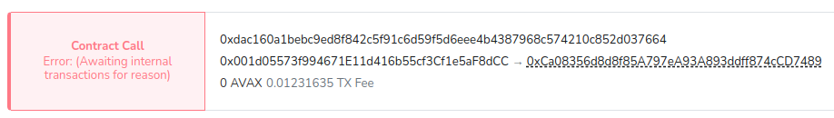

# Testnet
Demonstrating a failed swap transaction in testnet

### When created answering to queries (see below)

### eventually reverting


### Build

```bash
make
```
### Config
Provide a runtime key arg for the const ethSenderAddr which you may change in main.go.
Contract addresses are set for testnet.

### Run Swap
```bash
./swap -ethkey 2434f
Sending HTLT with timestamp:  2021-02-17 00:53:18 +0200 EET expiration @ 2021-02-20 00:53:18 +0200 EET
Pending nonce: 64
init tx sent: 0xb430cc979f6f0a9a9ac041c428f75ea1c5bbe7a18d525e413f1e028dfa783d4f
init eth tx sent: 0xb430cc979f6f0a9a9ac041c428f75ea1c5bbe7a18d525e413f1e028dfa783d4fcreated trx hash: 0xb430cc979f6f0a9a9ac041c428f75ea1c5bbe7a18d525e413f1e028dfa783d4f
sleeping 2 seconds...
query eth HasSwap exists true, swapID:114b68255e648281e979243579ff00f10f13b24e1d20e4af34a9ed9969ea3778
sender addr: 0x001d05573f994671E11d416b55cf3Cf1e5aF8dCC
receiver addr: 0x90F8bf6A479f320ead074411a4B0e7944Ea8c9C1
swap id: 114b68255e648281e979243579ff00f10f13b24e1d20e4af34a9ed9969ea3778
random number hash: db0fa6b8f020a972a90453f6c87296993b32a05e3f92b1f712a363b9cf64c886
addr: 9d108807294d526c1fcd66d0fcefab1c402753f5
timestamp: 1613406818
expire time: 1613666018
erc20 amount: 1
amount: 0
getSwap() -> swap: 0x114b68255e648281e979243579ff00f10f13b24e1d20e4af34a9ed9969ea3778 0xdb0fa6b8f020a972a90453f6c87296993b32a05e3f92b1f712a363b9cf64c886 1613666018 1 0x90F8bf6A479f320ead074411a4B0e7944Ea8c9C1 0x9d108807294D526C1fCd66d0FCEFAb1C402753F5 0x001d05573f994671E11d416b55cf3Cf1e5aF8dCC
```